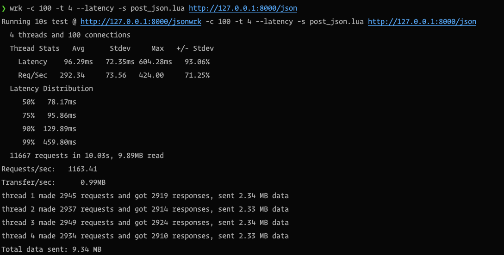
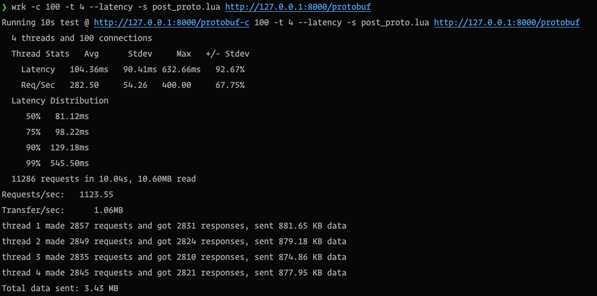

#### 和杜斌调试一下 protobuf 协议

> “非正式”表明这个仓库的内容既不是正式的产品开发线，也不是计划采用的项目。其主要用途可能为学习、实验或初步的想法验证和技术尝试。虽然这些项目可能包含有价值的信息和经验，但在参考或使用此项目的资料时，请注意其非正式的性质，并以适当的预防措施处理相关信息。


###### 资料

- https://github.com/protocolbuffers/protobuf 各个语言的运行时库
- https://protobuf.dev/programming-guides/dos-donts/ 最佳实践

###### proto 模板

- dummy_event.proto

###### 客户端接入文档
https://console-docs.apipost.cn/preview/55b56dff48c6f99e/cbeb85ae0cc50ea6

###### Benchmark

分别使用 `post_json.lua` 和 `post_proto.lua` 向接口发送 Json 和 Proto 数据，接口收到后解成 json 原样返回。

```bash
wrk -c 100 -t 4 --latency -s post_json.lua http://127.0.0.1:8000/json
```

```bash
wrk -c 100 -t 4 --latency -s post_proto.lua http://127.0.0.1:8000/protobuf
```


初步结论： 速度上相差不大， 发送数据量减少 2/3 ， proto 约为 json 的三分之一。

- 优点： 客户端提交数据量变小；等于用 proto 模板去约定数据结构。
- 缺点： 前后端要关注同一个 proto 模板，如果结构变更，要同时迭代发版，其中一个回滚可能会出现错误，结构更改只能见见进行，无法进行重大更改。没有 JSON 字符串直观。

- 建议：不使用， 个人觉得这东西更适合服务之间互相调用（同一个端，同一种发版策略，甚至服务之间的维护者是同一批人）
